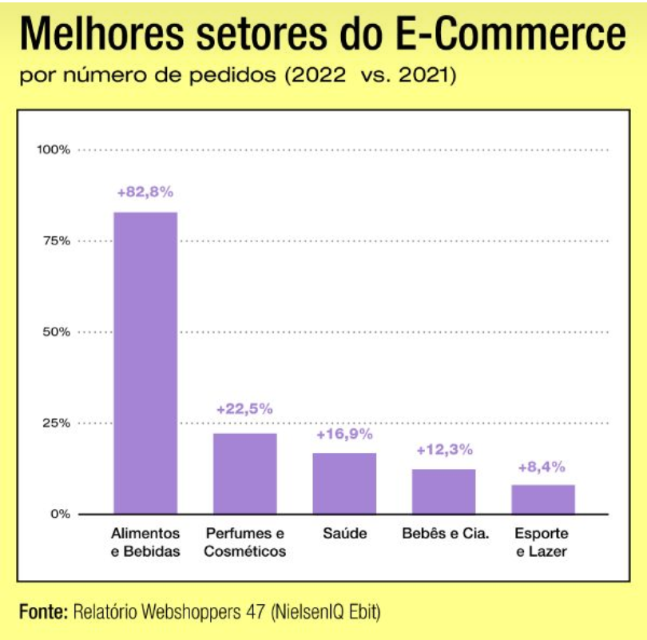
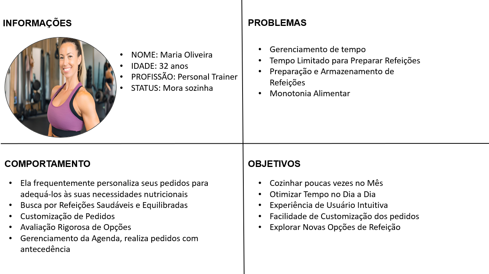
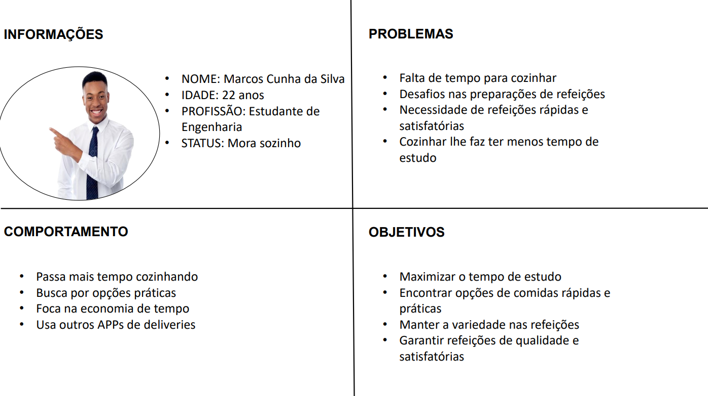
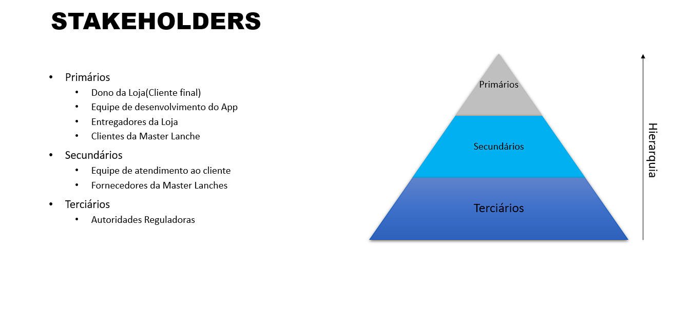

# Introdução

O projeto tem como objetivo automatizar o processo de realização de pedidos em uma hamburgueria, através da criação de um sistema de gestão de pedidos eficiente. Esse sistema buscará otimizar o atendimento ao cliente e melhorar a operação do estabelecimento, tornando o processo de pedidos mais rápido e preciso. Entre os principais objetivos do projeto, destacam-se o desenvolvimento de uma aplicação robusta, que simplifique a experiência do usuário e atenda às necessidades do negócio, garantindo agilidade e praticidade tanto para o cliente quanto para o gestor.

## Problema
Esse sistema busca resolver problemas de eficiência na realização de pedidos, e proporcionar uma experiência otimizada para o usuário.

A aplicação será desenvolvida para uma hamburgueria, cujo modelo de negócios inclui tanto o atendimento presencial quanto pedidos para retirada e entrega. A crescente demanda por agilidade e conveniência no atendimento justifica a criação de um sistema que automatize e otimize o processo de realização de pedidos.

Tecnologicamente, a aplicação será baseada em plataformas digitais acessíveis via dispositivos móveis. A integração com tecnologias de pagamento digital, como o PIX, bem como um sistema de gerenciamento de estoque, será essencial para manter a eficiência da operação e evitar transtornos como a venda de produtos esgotados.

## Objetivos
**Objetivo Geral**

Desenvolver uma aplicação de gestão de pedidos para uma hamburgueria que automatize o processo de compra e otimização das operações, garantindo agilidade, eficiência e uma experiência personalizada para os clientes.

**Objetivos Específicos**

Implementar o cadastro de usuários para que os clientes possam criar contas e armazenar suas informações de pedidos de forma segura.

Desenvolver a funcionalidade de autenticação de usuário, garantindo que apenas usuários autorizados acessem suas contas e façam pedidos.

Criar um sistema de gerenciamento de estoque que permita ao gestor controlar o nível de insumos e evitar a venda de produtos esgotados.

Integrar o pagamento via PIX, oferecendo uma solução de pagamento rápida e segura, alinhada às necessidades do mercado atual.

Incluir um controle de ativação e pausa de pedidos, permitindo ao gestor fechar temporariamente a loja em caso de alta demanda ou imprevistos, e reabri-la quando conveniente.

Otimizar a seleção de produtos, organizando-os por categorias ou oferecendo uma opção de busca por nome, facilitando a escolha do cliente e acelerando o processo de compra.
 
## Justificativa

A escolha por desenvolver uma aplicação de gestão de pedidos para uma hamburgueria está fortemente motivada pela necessidade de melhorar a conveniência e a eficiência, tanto para o cliente quanto para o gestor. Em um cenário onde os consumidores esperam um atendimento ágil e personalizado, a aplicação visa proporcionar uma experiência otimizada, com recursos como cadastro e autenticação de usuários, seleção de produtos de forma eficiente, e pagamento via PIX. Esses elementos garantem uma jornada de compra rápida e simples, com menos barreiras para o cliente.

Além disso, o gerenciamento de estoque e o controle de ativação e pausa de pedidos são essenciais para garantir que o estabelecimento possa ajustar seu funcionamento conforme a demanda, evitando sobrecargas ou falta de produtos, o que contribui para a eficiência operacional.

A personalização dos serviços também é um fator importante. Ao permitir que o cliente navegue de forma intuitiva, com opções de busca e filtros por categorias, a aplicação oferece flexibilidade e praticidade, tornando o atendimento mais direcionado às necessidades individuais.

Em suma, a motivação para este projeto é desenvolver uma solução que alinhe crescimento e eficiência, ao mesmo tempo em que proporciona uma experiência fluida e personalizada para o cliente.

## Público-Alvo

### 1. Descrição Textual
#### 1.1 Características Demográficas
* Idade: 18-45 anos 
* Gênero: Todos os gêneros 
* Localização: Residentes em áreas urbanas e suburbanas, preferencialmente em regiões onde o serviço de entrega é viável.
* Renda: Baixa a média-alta, que pode gastar com refeições fora de casa. 

#### 1.2 Características Comportamentais
* Conhecimentos Prévios: Usuários com experiências do basico ou avançado, que tenham uma certa familiaridade com aplicativos móveis e serviçoes de delivery.

* Relação com a tecnologia: Usuários com smartphones modernos, e com acesso frequente a internet. Eles utilizam aplicativos de forma cotidiana para diversas funções, compras online, entretenimento e redes sociais.

* Preferências Alimentares: Interessados em alimentos rápidos e saborosos, com uma inclinação para alimentos de conforto como hambúrgueres. Alguns podem ter preferências por opções gourmet ou saudáveis.

* Comportamento de Compra: Tendem a buscar conveniência e rapidez. Podem usar o aplicativo em momentos de fome ou quando desejam uma refeição sem sair de casa, especialmente durante horários de pico ou em dias de trabalho.

#### 1.3 Diagrama de Personas
##### Persona 1:

##### Persona 2:

# Mapa de Stakeholders
* O mapa retrata os principais stakeholders do projeto, a pirâmide descrevre a hierarquia de decisões no projeto, sendo os Stakeholders primários, os principais responsáveis por mudanças no projeto.
  
.

> **Links Úteis**:
> - [Público-alvo](https://blog.hotmart.com/pt-br/publico-alvo/)
> - [Como definir o público alvo](https://exame.com/pme/5-dicas-essenciais-para-definir-o-publico-alvo-do-seu-negocio/)
> - [Público-alvo: o que é, tipos, como definir seu público e exemplos](https://klickpages.com.br/blog/publico-alvo-o-que-e/)
> - [Qual a diferença entre público-alvo e persona?](https://rockcontent.com/blog/diferenca-publico-alvo-e-persona/)
