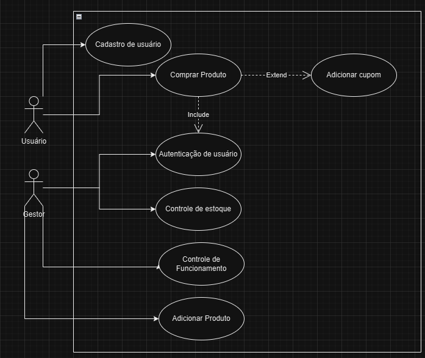
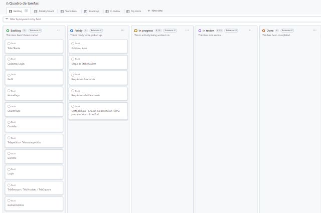

# Especificações do Projeto

Nesta seção, abordaremos tópicos que partem da perspectiva do usuário, organizados da seguinte forma:

1. **Personas**

2. **Histórias de Usuários**

3. **Requisitos**
   - 3.1 **Requisitos Funcionais**
   - 3.2 **Requisitos Não Funcionais**

4. **Restrições**

5. **Diagrama de Casos de Uso**

6. **Gerenciamento de Tempo**

7. **Gerenciamento de Equipe**

8. **Gestão de Orçamento**

## Personas

1_Marcos Cunha da Silva
Idade: 22 anos
Profissão: Estudante de Engenharia
Marcos está completamente focado em seus estudos e, para maximizar seu tempo, optou por morar sozinho e não cozinhar. Utiliza constantemente aplicativos de delivery para se alimentar de maneira prática e rápida, permitindo-lhe dedicar mais tempo aos seus estudos.

2_João Silva
Idade: 28 anos
Profissão: Não especificada
João é um apaixonado por gastronomia e está sempre em busca de novos sabores. Ele gosta de experimentar hambúrgueres artesanais, especialmente aqueles com combinações mais clássicas.

3_Maria Oliveira
Idade: 32 anos
Profissão: Personal Trainer
Maria é uma pessoa ativa e valoriza uma alimentação saudável. No entanto, ela também aprecia a indulgência ocasional de um bom hambúrguer, equilibrando sua dieta com prazer.

4_Carlos Souza
Idade: 45 anos
Profissão: Advogado
Carlos prefere hambúrgueres simples, mas bem feitos, com carne de alta qualidade e acompanhamentos tradicionais. Ele valoriza a simplicidade e o sabor autêntico em suas refeições.

5_Pedro Ferreira
Idade: 30 anos
Profissão: Viajante
Pedro adora explorar novos sabores e combinações em suas viagens. Ele está sempre em busca de hambúrgueres artesanais únicos e inovadores, que proporcionem uma experiência gastronômica diferenciada.

6_Alexandre Talim
Idade: 35 anos
Profissão: Gestor de Suporte
Alexandre é um entusiasta de lanches artesanais e tem uma paixão especial por hambúrgueres com muito queijo. Ele busca constantemente novas e deliciosas variações desse prato clássico.

## Histórias de Usuários

Com base na análise das personas, foram identificadas as seguintes histórias de usuários:

| **Eu como... `PERSONA`**    | **Quero/Preciso... `FUNCIONALIDADE`**                         | **Para... `MOTIVO/VALOR`**                                                           |
|-----------------------------|---------------------------------------------------------------|---------------------------------------------------------------------------------------|
| Estudante                   | Fazer pedidos de forma rápida e simples                      | Poder me concentrar mais nos meus estudos e não desperdiçar tanto tempo nisso         |
| Amante de Gastronomia       | Explorar e experimentar novos sabores de hambúrgueres artesanais | Satisfazer minha paixão por gastronomia e descobrir combinações inovadoras            |
| Dono de Hambúrgueria        | Gerir meu estabelecimento maximizando o alcance de atendimento  | Aumentar os lucros e facilitar o controle sobre minha hamburgueria                     |
| Consumidor de Hambúrgueres  | Fazer pedidos de hambúrgueres simples, mas bem preparados com carne de qualidade e acompanhamentos clássicos | Desfrutar de uma refeição autêntica e de qualidade sem complicações                    |
| Explorador de Sabores       | Encontrar hambúrgueres artesanais únicos e inovadores em cada pedido | Experimentar novos sabores e combinações em cada refeição                             |
| Entusiasta de Queijo        | Pedir hambúrgueres artesanais com muito queijo                  | Satisfazer meu desejo por um hambúrguer indulgente e cheio de queijo                   |
| Profissional ocupado    | Realizar pedidos com agilidade e através de uma interface intuitiva | Economizar tempo durante a pausa para o almoço e minimizar o estresse no trabalho       |
## Requisitos

As tabelas que se seguem apresentam os requisitos funcionais e não funcionais que detalham o escopo do projeto. Para determinar a prioridade de requisitos, aplicar uma técnica de priorização de requisitos e detalhar como a técnica foi aplicada.

### Requisitos Funcionais

|ID    | Descrição do Requisito  | Prioridade |
|------|-----------------------------------------|----|
|RF-001| O sistema deve permitir que o usuário realize o cadastro, fornecendo nome, e-mail, senha, e confirmação de senha, endereço, telefone e cpf. | ALTA | 
|RF-002| O sistema deve permitir que o usuário faça login utilizando o e-mail e senha cadastrados. Caso as credenciais estejam incorretas, deve exibir uma mensagem de erro.   | ALTA |
|RF-003| O sistema deve permitir que o usuário navegue pela lista de produtos e adicione itens ao carrinho. Deve haver a opção de remover produtos antes da finalização da compra.   | ALTA |
|RF-004| O sistema deve permitir que o usuário aplique cupons de desconto durante a compra. O usuário deve inserir o código do cupom e, caso válido, o sistema deve recalcular o valor da compra com o desconto.   | ALTA |
|RF-005| O sistema deve exibir uma mensagem de confirmação de sucesso após o pedido ser finalizado com sucesso, contendo os detalhes da compra (produto, valor, tempo estimado de entrega/retirada).   | ALTA |
|RF-006| O sistema deve permitir que o gestor adicione novos produtos, fornecendo informações como nome, preço, descrição e imagem do produto.  | MÉDIA |
|RF-007| O sistema deve permitir que o gestor gerencie o estoque, podendo ativar ou desativar produtos específicos para exibição no catálogo de produtos.   | MÉDIA |
|RF-008| O sistema deve permitir que o gestor ative ou desative o funcionamento da loja, bloqueando novos pedidos quando desativada. | BAIXA |

### Requisitos não Funcionais

|ID     | Descrição do Requisito  |Prioridade |
|-------|-------------------------|----|
|RNF-001| O sistema deve ser totalmente responsivo, ajustando a interface para diferentes resoluções de tela em dispositivos móveis, tablets e desktops. | ALTA | 
|RNF-002| O sistema deve garantir que cada transição seja processada em no máximo 2 segundos, para evitar frustração do usuário. | ALTA |
|RNF-003| O sistema deve suportar até 1.000 usuários simultâneos, sem degradação de desempenho.  | MÉDIA |
|RNF-004| As senhas do usuário deve ser criptografada |  ALTA |
|RNF-005| O sistema deve garantir uma disponibilidade mínima de 99,9% durante o horário de funcionamento da loja, evitando interrupções.
|  MÉDIA |

## Restrições

O projeto está restrito pelos itens apresentados na tabela a seguir.

|ID| Restrição                                             |
|--|-------------------------------------------------------|
|01| O projeto deverá ser entregue até o final do semestre |

## Diagrama de Casos de Uso

### Nome do caso de uso: CADASTRO DE USUÁRIO
### Ator: Usuário

PRÉ-REQUISITOS: ...

FLUXO PRINCIPAL:
1.	Usuário acessa a página de cadastro.
2.	O sistema exibe um formulário para preenchimento dos dados.
3.	Usuário preenche os dados solicitados e confirma.
4.	Sistema armazena os dados do usuário com sucesso e exibe a mensagem de confirmação ao usuário.

PÓS-CONDIÇÃO: 
Usuário está cadastrado e pode fazer autenticação no aplicativo.

FLUXOS ALTERNATIVOS:

FLUXO ALTERNATIVO 1 – E-mail já cadastrado:
1.	O sistema detecta que já existe um usuário cadastrado com o e-mail informado.
2.	O sistema exibe a mensagem de erro ao usuário.
3.	O sistema retorna ao passo 3 do Fluxo Principal, permitindo que o usuário corrija o e-mail.

FLUXO ALTERNATIVO 2 – Campos obrigatórios não preenchidos:
1.	O sistema detecta que há campos obrigatórios não preenchidos.
2.	O sistema exibe a mensagem de erro ao usuário.
3.	O sistema retorna ao passo 3 do Fluxo Principal, permitindo que o usuário complete os campos faltantes.

FLUXO ALTERNATIVO 3 – Falha no armazenamento dos dados:
1.	O sistema não consegue armazenar os dados do usuário por algum motivo técnico.
2.	O sistema exibe a mensagem de erro ao usuário.
3.	O sistema retorna ao passo 3 do Fluxo Principal para que o usuário tente novamente.¬¬

### Nome do caso de uso: Autenticação do usuário
### Ator: Usuário

PRÉ-REQUISITOS: 
Usuário deve estar cadastrado na plataforma.

FLUXO PRINCIPAL:
1.	Usuário acessa a página de autenticação.
2.	O sistema exibe um formulário solicitando o e-mail e a senha.
3.	Usuário preenche os dados solicitados e confirma.
4.	O sistema autentica o usuário com sucesso e envia a mensagem sucesso ao usuário.

PÓS-CONDIÇÃO:
Usuário autenticado pode acessar os dados de sua conta no aplicativo.

FLUXOS ALTERNATIVOS:

FLUXO ALTERNATIVO 1 – Dados inválidos:
1.	O sistema detecta que o e-mail ou a senha informados estão incorretos.
2.	O sistema exibe a mensagem de erro ao usuário.
3.	O sistema retorna ao passo 3 do Fluxo Principal, permitindo que o usuário corrija os dados informados.

FLUXO ALTERNATIVO 2 – Campos obrigatórios não preenchidos:
1.	O sistema detecta que há campos obrigatórios não preenchidos.
2.	O sistema exibe a mensagem de erro ao usuário.
3.	O sistema retorna ao passo 3 do Fluxo Principal, permitindo que o usuário complete os campos faltantes.

FLUXO ALTERNATIVO 3 – Falha na autenticação:
5.	O sistema enfrenta um problema técnico e não consegue autenticar o usuário.
6.	O sistema exibe a mensagem de erro ao usuário.
7.	O sistema retorna ao passo 3 do Fluxo Principal para que o usuário tente novamente.¬¬

### Nome do caso de uso: Controle de estoque
### Ator: Gestor

PRÉ-REQUISITOS: 
Usuário deve estar autenticado com uma conta de gestor da aplicação.

FLUXO PRINCIPAL:
1.	O gestor acessa a página de controle de estoque.
2.	O sistema exibe a lista de produtos cadastrados.
3.	O gestor ativa ou desativa a disponibilidade de um produto e confirma a alteração.
4.	O sistema processa o comando e envia a mensagem de confirmação ao gestor.

PÓS-CONDIÇÃO:
A disponibilidade do produto estara atualizada conforme solicitado pelo gestor (ativada ou desativada).

FLUXO ALTERNATIVO – Falha na alteração:
1.	O sistema enfrenta um problema técnico e não consegue ativar ou desativar o produto.
2.	O sistema exibe a mensagem de erro ao gestor.
3.	O sistema retorna ao passo 3 do Fluxo Principal, permitindo que o gestor tente novamente.

### Nome do caso de uso: Controle de Funcionamento
### Ator: Gestor

PRÉ-REQUISITOS:
Usuário deve estar autenticado com uma conta de gestor da aplicação.

FLUXO PRINCIPAL:
1.	O gestor acessa a opção de controle de funcionamento da loja.
2.	O sistema exibe as opções ativar ou desativar a loja.
3.	O gestor seleciona a opção desejada (ativar ou desativar) e confirma.
4.	O sistema processa o comando e envia a mensagem de confirmação ao gestor.

PÓS-CONDIÇÃO: 
A loja estara ativada ou desativada conforme a solicitação do gestor.

FLUXO ALTERNATIVO – Falha na alteração:
1.	O sistema enfrenta um problema técnico e não consegue ativar ou desativar o loja.
2.	O sistema exibe a mensagem de erro ao gestor.
3.	O sistema retorna ao passo 3 do Fluxo Principal, permitindo que o gestor tente novamente.

### Nome do caso de uso: Adicionar produto
### Ator: Gestor

PRÉ-REQUISITOS:
Usuário deve estar autenticado com uma conta de gestor da aplicação.

FLUXO PRINCIPAL:
1.	O gestor acessa a opção de adicionar produto.
2.	O gestor insere os dados do produto (nome, preço, descrição, etc.).
3.	O sistema processa o comando e envia a mensagem de confirmação ao gestor.

PÓS-CONDIÇÃO: 
O produto esta disponivel na loja.

FLUXO ALTERNATIVO – Falha na adição:
4.	O sistema enfrenta um problema técnico e não cadastrar o produto.
5.	O sistema exibe a mensagem de erro ao gestor.
6.	O sistema retorna ao passo 2 do Fluxo Principal, permitindo que o gestor tente novamente.

### Nome do caso de uso: Comprar produto
### Ator: Usuário

PRÉ-REQUISITOS:
Usuário deve estar autenticado na aplicação.

FLUXO PRINCIPAL:
1. O usuário acessa a aplicação e navega até a seção de produtos.
2. O usuário seleciona os produtos desejados e adiciona ao carrinho.
3. O usuário escolhe o pedido será para entrega ou retirada na loja.
4. O usuário confirma o pedido e escolhe o método de pagamento.
5. O sistema processa o pedido e exibe a mensagem de confirmação ao usuário.
6. O sistema registra o pedido e envia a loja.

PÓS-CONDIÇÃO: 
O sistema aguarda a confirmação do pagamento.

FLUXO ALTERNATIVO – Falha na seleção de produtos:
1. O sistema enfrenta um problema técnico e não consegue adicionar os produtos ao carrinho.
2. O sistema exibe a mensagem de erro ao usuário.
3. O sistema retorna ao passo 2 do Fluxo Principal, permitindo que o usuário tente novamente.

### Nome do caso de uso: Aplicar Cupom (Extend do Caso de Uso: Comprar produto)
### Ator: Usuário

PRÉ-REQUISITOS: 
Usuário deve estar autenticado e ter um cupom válido.

FLUXO PRINCIPAL:
1. Durante a compra (após a seleção dos produtos), o usuário opta por aplicar um cupom de desconto.
2. O sistema solicita que o usuário insira o código do cupom.
3. O usuário insere o código e confirma.
4. O sistema aplica o cupom ao valor total da compra.

PÓS-CONDIÇÃO: 
O valor da compra é atualizado com o desconto do cupom, se válido.

FLUXOS ALTERNATIVO - Cumpom Inválido:
1. o Sistema detecta que o cupom é inválido.
2. O sistema envia mensagem de erro ao usuário.
3. O sistema retorna ao passo 3 do fluxo principal para que o usuário possa tentar novamente.

## Gerenciamento de Tempo

Periodo estimado 2 semanas para cumprir as tarefas a seguir.
#### PARTE DO CLIENTE
### Cadastro/Login
tempo desenvolvimento front end = 5 horas --- tempo de teste = 8 horas
tempo desenvolvimento back end = 10 horas --- tempo de teste = 12 horas

### Perfil 
tempo desenvolvimento front end = 2:30 horas --- tempo de teste = 2 horas
tempo desenvolvimento back end = 2 horas --- tempo de teste = 3 horas

### HomePage
tempo desenvolvimento front end = 6 horas --- tempo de teste = 10 horas
tempo desenvolvimento back end = 10 horas --- tempo de teste = 12 horas

### SearchPage
tempo desenvolvimento front end = 2 horas --- tempo de teste = 2 horas
tempo desenvolvimento back end = 3 horas --- tempo de teste = 3 horas

### Carrinho
tempo desenvolvimento front end = 1:30 horas --- tempo de teste = 2 horas
tempo desenvolvimento back end = 2 horas --- tempo de teste = 3 horas

### telaPedido -> status do pedido
tempo desenvolvimento front end = 1:30 horas --- tempo de teste = 1 horas
tempo desenvolvimento back end = 2:30 horas --- tempo de teste = 5 horas

#### PARTE DO GERENTE/ADMINISTRADOR
### Login
tempo desenvolvimento front end = 2:30 horas --- tempo de teste = 4 horas
tempo desenvolvimento back end = 5 horas --- tempo de teste = 6 horas

### Tela estoque
tempo desenvolvimento front end = 2 horas --- tempo de teste = 2 horas
tempo desenvolvimento back end = 5 horas --- tempo de teste = 6 horas

### Tela produto
tempo desenvolvimento front end = 1:30 horas --- tempo de teste = 3 horas
tempo desenvolvimento back end = 2 horas --- tempo de teste = 4 horas

### Tela cupom
tempo desenvolvimento front end = 2 horas --- tempo de teste = 4 horas
tempo desenvolvimento back end = 1:30 horas --- tempo de teste = 3 horas

### Gestão de pedidos

tempo desenvolvimento front end = 1:30 horas --- tempo de teste = 2 horas
tempo desenvolvimento back end = 6 horas --- tempo de teste = 8 horas

## Gerenciamento de Equipe 

## Gestão de Orçamento

### Informações do Orçamento

#### Recursos Humanos
- **Diego Rodrigues**: R$ 2.500,00 * 5 meses = R$ 12.500,00
- **Fredson Marinho**: R$ 2.500,00 * 5 meses = R$ 12.500,00
- **João Severino**: R$ 2.500,00 * 5 meses = R$ 12.500,00
- **Matheus Campos**: R$ 2.500,00 * 5 meses = R$ 12.500,00
- **Paulo Augusto**: R$ 2.500,00 * 5 meses = R$ 12.500,00
- **Paulo Roberto**: R$ 2.500,00 * 5 meses = R$ 12.500,00
- **Thiago Augusto**: R$ 2.500,00 * 5 meses = R$ 12.500,00

  **Total Recursos Humanos**: R$ 87.500,00

#### Hardware
- **Notebook**: R$ 2.500,00 * 7 integrantes = R$ 17.500,00

#### Rede
- **500mb**: R$ 100,00 * 7 integrantes * 5 meses = R$ 3.500,00

#### Software
- **Hospedagem**: R$ 128,45 * 5 meses = R$ 642,25

#### Serviços
- **Serviços**: R$ 0,00

