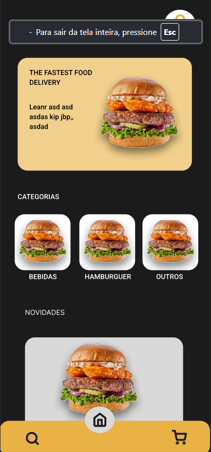

# Projeto de Interface

Nesta seção iremos passar pela visão geral da interação do usuário pelas telas do sistema e protótipo interativo das telas com as funcionalidades que fazem parte do sistema (wireframes).

## Diagrama de Fluxo

O fluxograma representa o caminho que o usuário percorre ao utilizar o site da lanchonete Master Lanches. O processo inicia com o acesso ao site, seguido pela verificação de cadastro, onde o usuário pode realizar o login ou criar uma nova conta. Após esse passo, o usuário escolhe os itens desejados, seleciona o método de pagamento, confirma o pedido e, por fim, acompanha o status do pedido até a sua entrega.

## Wireframes

| Tela | Descrição |
|------|-----------|
|  | A **Tela Principal** apresenta grande parte do conteúdo (lanches, bebidas, cupons, etc.). É nesta tela onde o usuário passará a maior parte do tempo de utilização; por isso, julgamos necessário que ela seja a mais interativa possível para proporcionar uma melhor experiência de uso. Além disso, a interface deve ser intuitiva, permitindo fácil navegação entre as diferentes seções e promoções disponíveis. |
|  | A **Tela de Status do Pedido** oferece uma visão clara do progresso da sua compra, mantendo-o informado. Aqui, você pode acompanhar facilmente desde a confirmação até o tempo estipulado de entrega, garantindo que sua experiência seja tranquila. |
|  | Nesta tela, o administrador pode controlar o estoque de produtos, bebidas, etc. A interface é bem intuitiva, minimizando o número de passos necessários para realizar uma tarefa. É também nesta tela que o administrador fará a adição de novos produtos, bebidas e cupons promocionais. |
|  | Nesta tela, o administrador poderá ter controle sobre os clientes/usuários que têm acesso à aplicação, com a opção de bloqueá-los ou desbloqueá-los caso seja necessário. |
