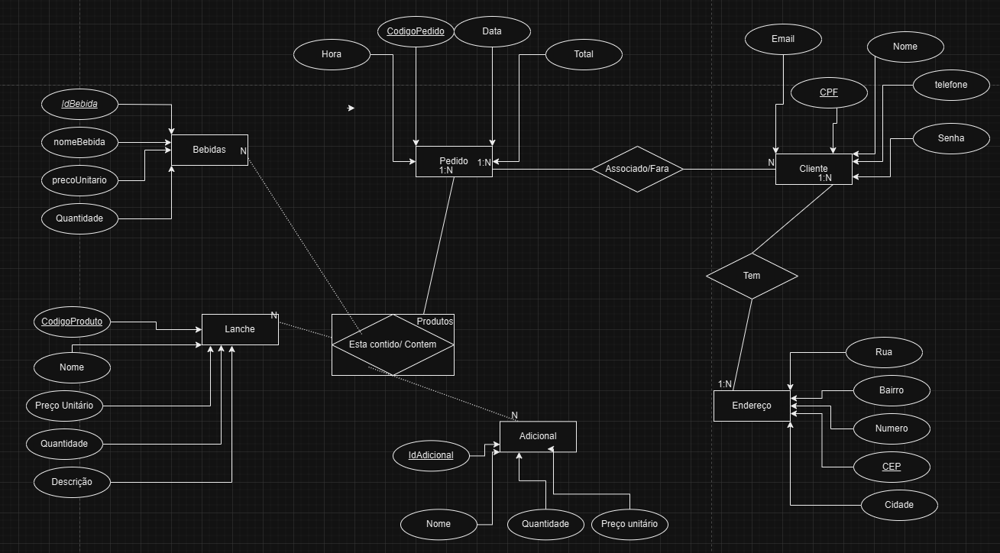
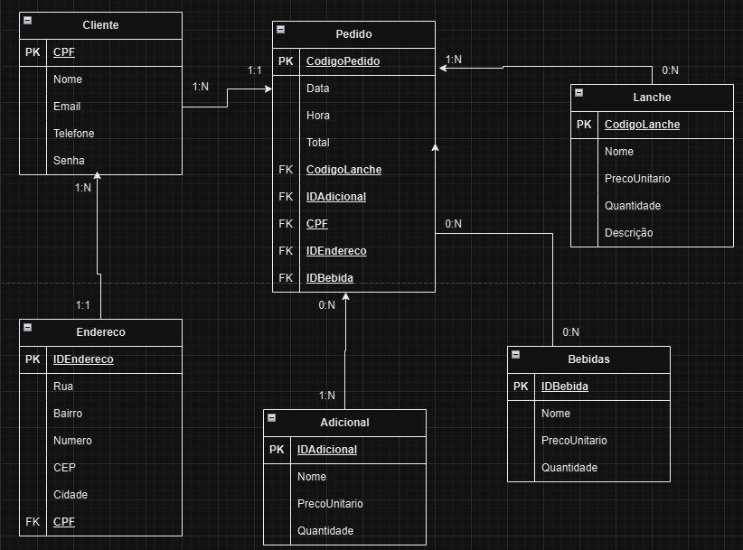
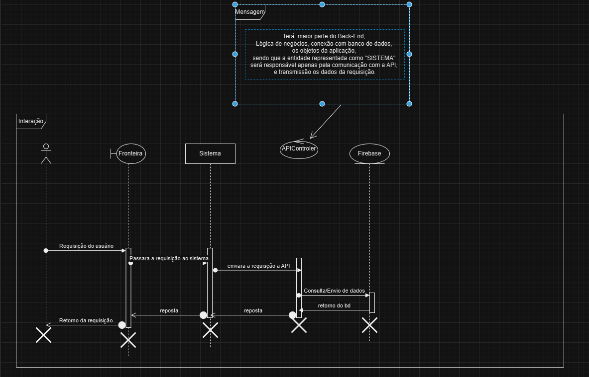

# Arquitetura da Solução

Pré-requisitos: <a href="3-Projeto de Interface.md"> Projeto de Interface</a>

Definição de como o software é estruturado em termos dos componentes que fazem parte da solução e do ambiente de hospedagem da aplicação.

## Diagrama de Classes

O diagrama de classes ilustra graficamente como será a estrutura do software, e como cada uma das classes da sua estrutura estarão interligadas. Essas classes servem de modelo para materializar os objetos que executarão na memória.

As referências abaixo irão auxiliá-lo na geração do artefato “Diagrama de Classes”.

> - [Diagramas de Classes - Documentação da IBM](https://www.ibm.com/docs/pt-br/rational-soft-arch/9.6.1?topic=diagrams-class)
> - [O que é um diagrama de classe UML? | Lucidchart](https://www.lucidchart.com/pages/pt/o-que-e-diagrama-de-classe-uml)

## Modelo ER

## Esquema Relacional

## Modelo Físico

Entregar um arquivo banco.sql contendo os scripts de criação das tabelas do banco de dados. Este arquivo deverá ser incluído dentro da pasta src\bd.

## Tecnologias Utilizadas
### Linguagens : C#, JavaScript.
### Banco de dados : Firebase
### bibliotecas :  React, React Native.
### IDEs : Visual Studio Code, ou a ferramenta web expo (Devido a restriçÕes de recursos tecnológicos nem todos conseguiram umas VSCode)
### Ferramentas de criação de diagramas : Lucidchart, Draw.IO.

Apresente também uma figura explicando como as tecnologias estão relacionadas ou como uma interação do usuário com o sistema vai ser conduzida, por onde ela passa até retornar uma resposta ao usuário.

## Hospedagem

Explique como a hospedagem e o lançamento da plataforma foi feita.

> **Links Úteis**:
>
> - [Website com GitHub Pages](https://pages.github.com/)
> - [Programação colaborativa com Repl.it](https://repl.it/)
> - [Getting Started with Heroku](https://devcenter.heroku.com/start)
> - [Publicando Seu Site No Heroku](http://pythonclub.com.br/publicando-seu-hello-world-no-heroku.html)

## Qualidade de Software

**1. Adequação**
- **Justificativa:** Esta subcaracterística garante que as funcionalidades desenvolvidas atendam aos requisitos e necessidades dos usuários, especialmente no fluxo de pedidos. Como o objetivo é fornecer um sistema que permita aos usuários fazer pedidos de forma simples e eficaz, a adequação é essencial para que o software entregue exatamente o que foi planejado.
- **Métricas:** Percentual de cobertura dos requisitos, quantidade de funcionalidades essenciais implementadas corretamente.

**2. Acurácia**
**- Justificativa:** A acurácia assegura que as funções implementadas forneçam resultados corretos e precisos, o que é crucial para que o usuário visualize corretamente os itens disponíveis, preços e status dos pedidos.
**- Métricas:** Taxa de erro nas informações mostradas ao usuário, precisão dos cálculos de preços e totais.

**3. Conformidade**
**- Justificativa:** A conformidade garante que o software siga normas e regulamentos, como leis de proteção ao consumidor e requisitos fiscais para lanchonetes, assegurando que o projeto atenda a todas as regulamentações legais necessárias.
**- Métricas:** Número de violações de conformidade, tempo médio para corrigir problemas de conformidade.

**4. Segurança de Acesso**
**- Justificativa:** A segurança é fundamental, especialmente para proteger os dados pessoais e financeiros dos usuários, como informações de login e métodos de pagamento. A segurança de acesso assegura que apenas usuários autorizados tenham acesso ao sistema e aos dados sensíveis.
**- Métricas:** Número de vulnerabilidades de segurança identificadas, tempo de resposta a incidentes de segurança.

**5. Tolerância a Falhas**
**- Justificativa:** Esta subcaracterística é crucial para garantir que o sistema funcione de forma contínua, mesmo em casos de erros inesperados. A tolerância a falhas é importante para evitar interrupções na experiência do usuário, especialmente durante o processo de pedido ou pagamento.
**- Métricas:** Taxa de falhas do sistema, tempo médio de recuperação após uma falha.

**6. Inteligibilidade**
- **Justificativa:** A inteligibilidade refere-se à facilidade com que os usuários entendem e utilizam o sistema. Como o público da Master Lanches pode variar em termos de experiência com tecnologia, é essencial que a interface seja clara e intuitiva.
- **Métricas:** Número de reclamações relacionadas à dificuldade de uso, tempo médio que os usuários levam para completar um pedido.

**7. Capacidade para ser Instalado**
**- Justificativa:** A facilidade de instalação é importante para garantir que o software seja acessível a todos os usuários, independente do dispositivo que utilizam. O software precisa ser fácil de configurar e utilizar, sem complicações técnicas.
**- Métricas:** Tempo médio de instalação, número de problemas relatados durante a instalação.

**8. Modificabilidade**
**- Justificativa:** A modificabilidade garante que o software possa ser atualizado e adaptado facilmente conforme surgem novas demandas ou alterações nos requisitos. Isso é essencial para acompanhar a evolução do negócio e dos hábitos dos consumidores.
**- Métricas:** Tempo e esforço necessário para realizar modificações, quantidade de código reutilizável.

**9. Estabilidade**
**- Justificativa:** A estabilidade assegura que o sistema não sofra grandes mudanças que comprometam seu funcionamento com o passar do tempo, mantendo uma performance constante e confiável.
**- Métricas:** Número de falhas após atualizações, tempo de inatividade do sistema.

**10. Testabilidade**
**- Justificativa:** A testabilidade é essencial para garantir que o software possa ser testado facilmente, identificando e corrigindo erros de forma eficaz antes que estes cheguem aos usuários finais. Isso aumenta a qualidade e reduz a incidência de falhas.
**- Métricas:** Cobertura de testes automatizados, tempo necessário para a execução de testes e validação.
